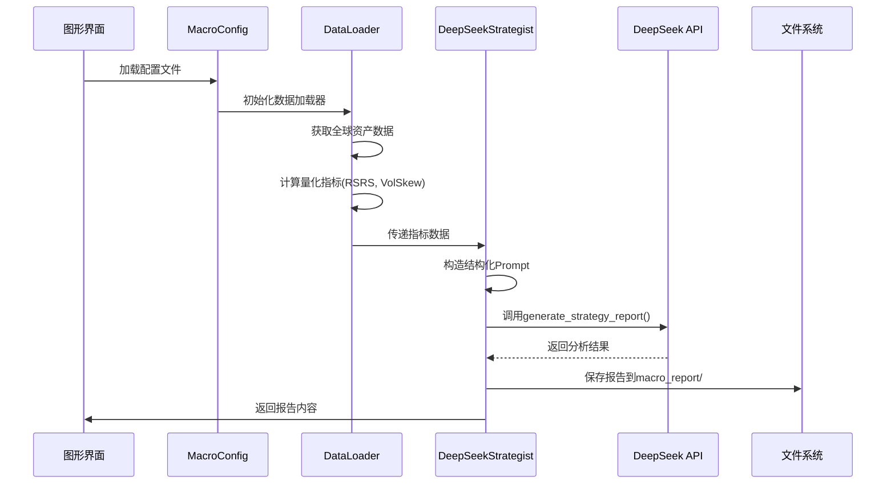
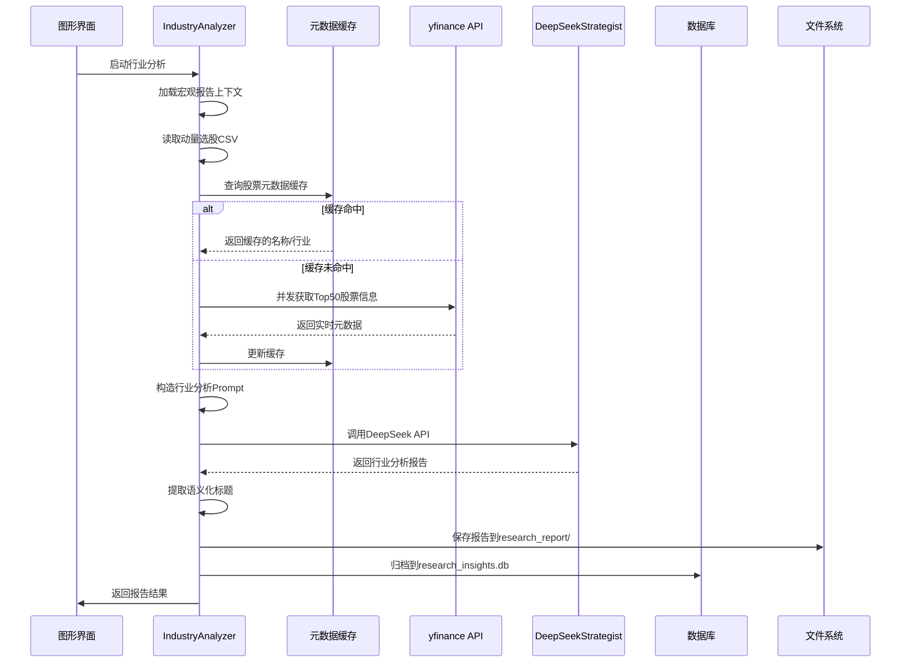

# MY-DOGE QUANT SYSTEM

**MY-DOGE QUANT SYSTEM** 是一个本地优先（Local-First）的量化投资战略指挥平台。它集成了通达信（TDX）本地数据清洗、宏观战略定调（Macro Beta）、微观动量选股（Micro Alpha）以及基于 LLM 的深度行业分析功能，旨在为个人投资者提供机构级的决策辅助。

## 目录

- [项目概览](#项目概览)
- [核心功能](#核心功能)
- [系统架构](#系统架构)
- [组件详解](#组件详解)
  - [数据清洗管道 (Data Pipeline)](#数据清洗管道-data-pipeline)
  - [宏观策略引擎 (Macro Engine)](#宏观策略引擎-macro-engine)
  - [AI 行业分析 (Industry Analysis)](#ai-行业分析-industry-analysis)
  - [知识库系统 (Knowledge Base)](#知识库系统-knowledge-base)
- [API 调用与模型集成](#api-调用与模型集成)
- [配置详解](#配置详解)
  - [配置文件结构详解](#配置文件结构详解)
  - [配置项说明](#配置项说明)
  - [运行时配置覆盖](#运行时配置覆盖)
- [API 调用详细流程](#api-调用详细流程)
  - [宏观策略生成流程](#宏观策略生成流程)
  - [行业分析流程](#行业分析流程)
  - [防幻觉机制实现](#防幻觉机制实现)
- [数据库架构](#数据库架构)
  - [表结构](#表结构)
  - [数据库初始化](#数据库初始化)
- [错误处理与系统健壮性](#错误处理与系统健壮性)
  - [API调用错误处理](#api调用错误处理)
  - [数据完整性检查](#数据完整性检查)
  - [降级策略](#降级策略)
- [扩展开发指南](#扩展开发指南)
  - [添加新量化指标](#添加新量化指标)
  - [自定义行业分析逻辑](#自定义行业分析逻辑)
  - [界面定制](#界面定制)
  - [性能优化建议](#性能优化建议)
- [部署注意事项](#部署注意事项)
  - [环境要求](#环境要求)
  - [代理配置](#代理配置)
  - [API配额管理](#api配额管理)
  - [数据备份](#数据备份)
- [故障排除](#故障排除)
  - [常见问题及解决方案](#常见问题及解决方案)
  - [日志查看](#日志查看)
- [贡献指南](#贡献指南)
  - [开发流程](#开发流程)
  - [代码规范](#代码规范)
  - [测试要求](#测试要求)
  - [文档更新](#文档更新)
  - [提交信息规范](#提交信息规范)
- [快速开始](#快速开始)
- [开发指南](#开发指南)

## 项目概览

MY-DOGE QUANT SYSTEM 采用**三层架构**，将数据清洗、策略生成和用户交互分离。所有数据本地存储，不依赖云服务，保护用户隐私并降低延迟。

本系统设计目标：
- **数据主权**：所有数据本地存储 (SQLite)，无云端依赖。
- **消除幻觉**：在 AI 推理过程中引入实时联网校准 (Real-time Calibration)，确保行业归类准确。
- **量化风控**：结合 LLM 的定性分析与 RSRS/VolSkew 等硬核定量指标。
- **易用性**：PyQt6 图形化界面，一键操作。

## 核心功能

*   **📊 双轨制数据中心** – 支持 A 股与美股的全量历史数据导入、清洗与本地存储，完全摆脱对昂贵数据终端的依赖。
*   **🌍 宏观战略定调** – 一键生成宏观对冲策略报告。
    *   **量化仪表盘**：集成 **RSRS (阻力支撑相对强度)** 判断趋势强度，**Vol Skew (波动率偏度)** 预警变盘风险。
    *   **AI 决策**：由 DeepSeek 判定当前市场水位 (Risk-On / Risk-Off)。
*   **🧠 行业景气度扫描** – 结合宏观背景与微观强势股清单，利用大模型推理产业链共振逻辑。
    *   **防幻觉机制**：自动并发调用 `yfinance` 校验股票名称与所属板块，修正 AI 的认知偏差。
    *   **智能缓存**：股票元数据自动缓存至本地 JSON 文件，网络不佳时仍可离线演示，提升系统健壮性。
    *   **语义化归档**：自动提取研报核心结论作为标题进行归档。
*   **📈 动量选股** – 基于修正的动量模型筛选强势股。
*   **💾 研报智库** – 自动归档所有分析报告至本地数据库，支持历史回溯与知识沉淀。

## 系统架构

### 三层架构

```
┌─────────────────────────────────────────────────────────────┐
│                   交互层 (Interface Layer)                   │
│  [Dashboard] 主控台集成                                      │
│  ├── 🚀 市场扫描 (Scanner)                                   │
│  ├── 🇨🇳/🇺🇸 档案局 (Data Editor)                              │
│  ├── 🧠 研报智库 (Insights)                                  │
│  └── 🔎 行业扫描 (Analysis)                                  │
└─────────────────────────────────────────────────────────────┘
                            │
┌─────────────────────────────────────────────────────────────┐
│                   微观层 (Micro Layer)                      │
│  [TDXLoader] 通达信解析  →  [MarketScanner] 清洗过滤         │
│  [Momentum] 动量计算     →  [IndustryAnalyzer] 行业分析      │
│  (特性: 实时联网校准股票元数据)                               │
└─────────────────────────────────────────────────────────────┘
                            │
┌─────────────────────────────────────────────────────────────┐
│                   宏观层 (Macro Layer)                      │
│  [DataLoader] 全球资产数据 (yfinance)                        │
│  [Strategist] 策略生成 (DeepSeek API)                        │
│  (特性: RSRS趋势 + VolSkew风控 + 结构化Prompt)               │
└─────────────────────────────────────────────────────────────┘
```

### 数据流转 (Data Flow)

1.  **数据摄入**: 通达信 `.day` 文件 → 清洗过滤 → `market_data_*.db`
2.  **宏观定调**: 全球资产数据 → 计算量化指标 (RSRS, VolSkew) → **DeepSeek 推理** → 生成 `Macro Report`
3.  **行业分析**: 
    *   输入: `Macro Report` (宏观背景) + `Momentum CSV` (强势股)
    *   **校准**: 并发联网获取 Top 50 股票的真实业务信息
    *   推理: **DeepSeek** 归纳产业链共振逻辑
    *   输出: `Industry Report` (存入 `research_insights.db`)

## 组件详解

### 数据清洗管道 (Data Pipeline)

-   **TDXReader**: 高性能解析通达信二进制数据 (`src/micro/tdx_loader.py`)。
-   **MarketScanner**: 
    -   **A股过滤**: 保留 `00`, `30`, `60`, `68` 开头代码，剔除指数/基金。
    -   **美股过滤**: 仅保留纯字母代码，剔除粉单/OTC。

### 宏观策略引擎 (Macro Engine)

-   **位置**: `src/macro/strategist.py`
-   **量化仪表盘 (Quantitative Dashboard)**:
    -   **RSRS (趋势强度)**: 基于 R² 与斜率符号的标准化指标，范围在 -1.0 到 1.0 之间。
        -   **RSRS > 0.8**: 极强上涨趋势
        -   **0.5 < RSRS ≤ 0.8**: 中等上涨趋势  
        -   **-0.5 ≤ RSRS ≤ 0.5**: 震荡或无趋势
        -   **-0.8 ≤ RSRS < -0.5**: 中等下跌趋势
        -   **RSRS < -0.8**: 极强下跌趋势
    -   **Vol Skew (5d/20d)**: 短期与中期波动率的比值。`< 0.8` 暗示变盘在即，`> 1.5` 暗示恐慌释放。
-   **Prompt Engineering**:
    -   采用 **System Prompt** 强制要求数据引用 ("根据数据 [120天趋势 +5.2%]...")。
    -   严禁混淆短期波动与长期趋势。

### 微观动量选股引擎 (Micro Momentum Engine)

-   **位置**: `src/micro/momentum_scanner.py`
-   **算法核心**: 
    -   基于**收盘价与时间序列的线性回归**，计算趋势强度指标 $\text{RSRS}_{\text{micro}} = R^2 \times \text{sign}(\text{Slope})$。
    -   **数学定义**: 对最近 $T$ 个交易日的收盘价序列 $(y_1, y_2, ..., y_T)$ 与时间 $(1, 2, ..., T)$ 进行普通最小二乘法 (OLS) 回归：
        $$y_t = \alpha + \beta \cdot t + \epsilon_t$$
        其中 $\beta$ 为斜率（趋势方向），$R^2$ 为决定系数（趋势平滑度）。
    -   **输出范围**: $-1.0$ 到 $+1.0$。
        -   $+1.0$: 完美的匀速上涨。
        -   $-1.0$: 完美的匀速下跌。
        -   $0.0$: 纯粹震荡或无序波动。
-   **参数选择依据**:
    -   **窗口 $T = 18$**:
        1.  **交易月近似**: 18个交易日 ≈ 一个月（20-22天）的短周期，能过滤短期噪声而不产生过大滞后。
        2.  **行业标准参考**: 光大证券 RSRS 研报中使用的标准参数 $N=18$，经过广泛回测验证。
        3.  **动量效应窗口**: 位于短中期交界，配合 $R^2$ 过滤，旨在筛选“涨得稳”（而不是“涨得快”）的标的，这类标的更大概率在接下来的 2 周内维持惯性。
    -   **向量化优化**: 利用线性代数预计算统计量，将计算复杂度从 $O(N \cdot T)$ 降至 $O(N)$，对于全市场扫描（$N > 10,000$）性能提升 **100 倍以上**。
-   **与标准 RSRS 的区别**:
    | 维度 | 当前实现 (Micro Momentum) | 标准 RSRS (Macro Timing) |
    |------|---------------------------|--------------------------|
    | 回归对象 | 收盘价 vs 时间 $(Close \sim Time)$ | 最高价 vs 最低价 $(High \sim Low)$ |
    | 物理含义 | 价格上涨的平滑度/稳定性 | 支撑位与阻力位的相对强度 |
    | 优势 | 能有效识别“稳步推升”的黑马股，过滤大幅波动的妖股 | 能提前预判支撑阻力结构的崩塌（更适合择时） |
    | 适用场景 | **个股选股 (Stock Selection)** | **大盘择时 (Market Timing)** |
-   **配置解耦**:
    -   黑名单、流动性阈值、窗口长度等参数已移至 `models_config.json` 的 `scanner_filters` 节。
    -   支持动态更新，无需修改代码，遵循“开闭原则”。

### AI 行业分析 (Industry Analysis)

-   **位置**: `src/micro/industry_analyzer.py`
-   **工作流程**:
    1.  **加载上下文**: 自动读取最新的宏观报告摘要 (Risk Signal)。
    2.  **加载微观数据**: 读取动量选股生成的 CSV 文件。
    3.  **联网校准 (关键特性)**: 使用 `ThreadPoolExecutor` 并发请求 `yfinance`，获取 Top 50 股票的准确名称和行业分类，注入到 Prompt 中。这有效解决了 LLM 对 A 股代码/名称对应的幻觉问题。
    4.  **深度推理**: DeepSeek 识别细分赛道集群，生成产业链图谱。
    5.  **自动归档**: 正则提取报告中的 `TITLE:` 字段，以语义化标题存入数据库。

### 知识库系统 (Knowledge Base)

-   **数据库**: `data/research_insights.db`
-   **表结构**:
    -   `macro_reports`: 存储宏观策略，包含风险信号和波动率数据。
    -   `research_reports`: 存储行业研报，包含语义化标题和完整分析。
-   **冷启动**: `initialize_system_dbs()` 确保系统首次运行时自动创建所有必要的表结构。

## API 调用与模型集成

### DeepSeek 集成

系统深度集成 DeepSeek API，支持多种模型配置：

-   **DeepSeek Chat (v3)**: 适用于行业分析、文本生成，速度快，逻辑通顺。
-   **DeepSeek Reasoner (R1)**: 适用于宏观复杂逻辑推理，擅长处理多变量博弈。

### 配置管理 (`models_config.json`)

系统通过 `models_config.json` 文件进行集中配置，支持多模型切换、资产配置和代理设置。

#### 配置文件结构详解

```json
{
    "profiles": [
        {
            "name": "🚀 DeepSeek Chat (Standard)",
            "base_url": "https://api.deepseek.com",
            "model": "deepseek-chat",
            "api_key": "YOUR_API_KEY_HERE"
        },
        {
            "name": "🧠 DeepSeek Reasoner (R1 - Pro)",
            "base_url": "https://api.deepseek.com",
            "model": "deepseek-reasoner",
            "api_key": "YOUR_API_KEY_HERE"
        },
        {
            "name": "🏠 LM Studio (Local)",
            "base_url": "http://localhost:1234/v1",
            "model": "local-model",
            "api_key": "lm-studio"
        }
    ],
    "default_profile": "🚀 DeepSeek Chat (Standard)",
    "macro_settings": {
        "lookback_days": 120,          // 中期趋势分析窗口（交易日）
        "volatility_window": 20        // 波动率计算窗口
    },
    "assets": {
        "tech": {
            "symbol": "QQQ",
            "name": "科技股(纳指)"
        },
        "safe": {
            "symbol": "GLD",
            "name": "避险黄金"
        },
        "crypto": {
            "symbol": "BTC-USD",
            "name": "数字货币"
        },
        "target": {
            "symbol": "000300.SS",
            "name": "A股核心(沪深300)"
        }
    },
    "proxy_settings": {
        "enabled": false,              // 是否启用代理
        "url": "http://127.0.0.1:7890" // 代理服务器地址
    },
    "scanner_filters": {
        "us_blacklist": ["SQQQ", "TQQQ", "SOXL", "SOXS", "SPXU", "SPXS", "SDS", "SSO", "UPRO", "QID", "QLD", "TNA", "TZA", "UVXY", "VIXY", "SVXY", "LABU", "LABD", "YANG", "YINN", "FNGU", "FNGD", "WEBL", "WEBS", "KOLD", "BOIL", "TSLY", "NVDY", "AMDY", "MSTY", "CONY", "APLY", "GOOY", "MSFY", "AMZY", "FBY", "OARK", "XOMO", "JPMO", "DISO", "NFLY", "SQY", "PYPY", "AIYY", "YMAX", "YMAG", "ULTY", "SVOL", "TLTW", "HYGW", "LQDW", "BITX"],
        "min_volume_cn": 200000000,
        "min_volume_us": 20000000,
        "max_change_pct": 400,
        "rsrs_window": 18
    }
}
```

#### 配置项说明

| 配置组 | 字段 | 说明 | 默认值 |
|--------|------|------|--------|
| `profiles` | `name` | 模型配置名称（显示在GUI中） | - |
| | `base_url` | API 基础地址 | `https://api.deepseek.com` |
| | `model` | 模型标识符 | `deepseek-chat` |
| | `api_key` | API 密钥 | 需要用户填写 |
| `default_profile` | - | 默认使用的模型配置名称 | `🚀 DeepSeek Chat (Standard)` |
| `macro_settings` | `lookback_days` | 中期趋势分析天数 | 120 |
| | `volatility_window` | 波动率计算窗口 | 20 |
| `assets` | `tech`/`safe`/`crypto`/`target` | 四大资产类别配置 | 见上方 |
| `proxy_settings` | `enabled` | 是否启用代理 | `false` |
| | `url` | 代理服务器地址 | `http://127.0.0.1:7890` |
| `scanner_filters` | `us_blacklist` | 美股杠杆/反向ETF黑名单 | 包含SQQQ, TQQQ等 |
| | `min_volume_cn` | A股最低日均成交额阈值（单位：人民币） | 200000000 |
| | `min_volume_us` | 美股最低日均成交额阈值（单位：美元） | 20000000 |
| | `max_change_pct` | 最大涨跌幅过滤（防止虚假暴涨） | 400 |
| | `rsrs_window` | RSRS计算窗口（交易日数） | 18 |

#### 运行时配置覆盖

系统支持通过环境变量动态覆盖配置：
```bash
# 临时切换模型（优先级高于配置文件）
export DEEPSEEK_MODEL="deepseek-reasoner"
export DEEPSEEK_API_KEY="your_new_key_here"
```

GUI界面也提供模型切换功能，切换后会自动更新内存中的配置。

## API 调用详细流程

### 宏观策略生成流程 (`src/macro/strategist.py`)



#### 关键实现细节

1. **数据准备阶段**：
   - 通过 `yfinance` 获取指定资产的历史价格数据
   - 计算 RSRS（趋势强度）和 VolSkew（波动率偏度）指标
   - 生成结构化数据块，便于LLM精确引用

2. **Prompt工程**：
   - **System Prompt**：定义分析师角色和核心规则
   - **User Prompt**：包含结构化数据、量化仪表盘和最近价格明细
   - **强制数据引用**：要求所有结论必须明确引用数据来源

3. **错误处理**：
   - API调用失败时记录详细日志
   - 网络超时自动重试机制
   - 返回空内容时的降级处理

### 行业分析流程 (`src/micro/industry_analyzer.py`)



#### 防幻觉机制实现

1. **并发联网校准**：
   - 使用 `ThreadPoolExecutor` 并发获取Top 50股票的实时信息
   - 最大工作线程数：3（避免API限流）
   - 重试机制：失败后等待2秒重试，最多3次

2. **智能缓存系统**：
   - 缓存文件：`data/meta_cache.json`
   - 原子写入：避免数据损坏
   - 离线支持：网络不佳时使用缓存数据

3. **语义化归档**：
   - 正则提取报告中的 `TITLE:` 字段
   - 使用语义化标题作为数据库记录标识
   - 便于历史回溯和知识检索

## 数据库架构

### `research_insights.db` 表结构

#### `macro_reports` 表 - 存储宏观策略报告

| 字段名 | 类型 | 说明 | 示例 |
|--------|------|------|------|
| `id` | INTEGER | 主键，自增 | 1 |
| `title` | TEXT | 报告标题 | "MY-DOGE PRECISION MACRO REPORT" |
| `content` | TEXT | 完整报告内容 | Markdown格式报告 |
| `risk_signal` | TEXT | 风险信号 | "Risk-On" 或 "Risk-Off" |
| `volatility` | REAL | 波动率 | 0.1725 (17.25%) |
| `created_at` | TEXT | 创建时间 | "2024-01-06 16:28:23" |
| `analyst` | TEXT | 分析模型 | "deepseek-chat" |
| `tags` | TEXT | 标签 | "Macro,DeepSeek" |

#### `research_reports` 表 - 存储行业研报

| 字段名 | 类型 | 说明 | 示例 |
|--------|------|------|------|
| `id` | INTEGER | 主键，自增 | 1 |
| `title` | TEXT | 语义化标题 | "新能源产业链景气度上行分析" |
| `content` | TEXT | 完整报告内容 | Markdown格式报告 |
| `market_type` | TEXT | 市场类型 | "CN" 或 "US" |
| `created_at` | TEXT | 创建时间 | "2024-01-06 16:30:45" |
| `analyst` | TEXT | 分析模型 | "deepseek-chat" |
| `tags` | TEXT | 标签 | "Industry,DeepSeek,新能源" |

#### 数据库初始化

系统首次运行时自动创建数据库和表结构：

```python
# src/micro/database.py 中的初始化函数
def initialize_system_dbs():
    """初始化系统数据库"""
    conn = sqlite3.connect('data/research_insights.db')
    cursor = conn.cursor()
    
    # 创建宏观报告表
    cursor.execute('''
        CREATE TABLE IF NOT EXISTS macro_reports (
            id INTEGER PRIMARY KEY AUTOINCREMENT,
            title TEXT NOT NULL,
            content TEXT NOT NULL,
            risk_signal TEXT,
            volatility REAL,
            created_at TEXT DEFAULT CURRENT_TIMESTAMP,
            analyst TEXT,
            tags TEXT
        )
    ''')
    
    # 创建行业研报表
    cursor.execute('''
        CREATE TABLE IF NOT EXISTS research_reports (
            id INTEGER PRIMARY KEY AUTOINCREMENT,
            title TEXT NOT NULL,
            content TEXT NOT NULL,
            market_type TEXT,
            created_at TEXT DEFAULT CURRENT_TIMESTAMP,
            analyst TEXT,
            tags TEXT
        )
    ''')
    
    conn.commit()
    conn.close()
```

## 错误处理与系统健壮性

### 1. API调用错误处理

| 错误类型 | 处理策略 | 用户反馈 |
|----------|----------|----------|
| **网络超时** | 自动重试3次，每次间隔2秒 | "网络连接不稳定，正在重试..." |
| **API密钥无效** | 立即停止，记录错误日志 | "API密钥无效，请检查配置" |
| **模型不可用** | 切换到默认模型配置 | "请求的模型不可用，已切换至默认模型" |
| **速率限制** | 指数退避重试，限制并发 | "API调用频繁，等待后重试" |

### 2. 数据完整性检查

- **通达信数据验证**：检查 `.day` 文件格式和完整性
- **CSV文件验证**：确保动量选股文件包含必要字段
- **数据库连接验证**：连接失败时自动重连
- **缓存一致性**：定期清理过期的缓存数据

### 3. 降级策略

- **离线模式**：网络不可用时使用缓存数据进行演示
- **简化分析**：API配额不足时提供基础分析报告
- **本地回退**：云端API失败时尝试本地模型（如配置了LM Studio）

## 扩展开发指南

### 添加新量化指标

1. **修改 `src/macro/data_loader.py`**：

```python
def calculate_advanced_metrics(self, df):
    """计算高级量化指标"""
    # 现有指标计算...
    rsrs = self.calculate_rsrs(df)
    vol_skew = self.calculate_vol_skew(df)
    
    # 添加新指标，例如：动量偏离度
    momentum_deviation = self.calculate_momentum_deviation(df)
    
    # 将新指标添加到返回字典
    metrics = {
        'tech_rsrs': rsrs,
        'vol_skew': vol_skew,
        'momentum_deviation': momentum_deviation,  # 新增
        # ... 其他指标
    }
    return metrics
```

2. **更新策略提示词** (`src/macro/strategist.py`)：
   - 在 `generate_strategy_report` 方法中添加新指标的数据展示
   - 更新System Prompt中的指标解释说明

### 自定义行业分析逻辑

1. **修改提示词模板** (`src/micro/industry_analyzer.py`)：
   - 调整 `run_analysis` 方法中的Prompt结构
   - 添加新的分析维度要求

2. **扩展元数据获取**：
   - 集成其他数据源（如东方财富、雪球）
   - 添加自定义数据清洗逻辑

### 界面定制

1. **添加新功能页签**：
   - 在 `src/interface/dashboard.py` 中添加新的QWidget
   - 设计对应的业务逻辑类

2. **自定义主题**：
   - 修改PyQt6样式表 (`QSS`)
   - 适配深色/浅色主题

### 性能优化建议

1. **数据缓存优化**：
   - 使用LRU缓存高频访问的数据
   - 压缩历史数据存储

2. **并发处理**：
   - 合理设置线程池大小（建议3-5个线程）
   - 使用异步IO处理网络请求

3. **内存管理**：
   - 及时释放大尺寸DataFrame
   - 使用生成器处理流式数据

## 部署注意事项

### 1. 环境要求

- **Python版本**: 3.8+
- **内存要求**: 至少8GB RAM（处理大数据集时）
- **磁盘空间**: 至少10GB可用空间（用于存储历史数据）
- **网络连接**: 稳定的互联网连接（用于API调用和数据获取）

### 2. 代理配置

如果处于需要代理的网络环境：

1. **编辑 `models_config.json`**：
```json
{
    "proxy_settings": {
        "enabled": true,
        "url": "http://your-proxy-server:port"
    }
}
```

2. **环境变量设置**：
```bash
# 临时设置代理
set HTTP_PROXY=http://your-proxy-server:port
set HTTPS_PROXY=http://your-proxy-server:port
```

### 3. API配额管理

- **DeepSeek API**：关注调用频率限制和月度配额
- **yfinance**：免费但有请求频率限制，建议添加延迟避免被封禁
- **本地模型**：确保LM Studio或Ollama服务正常运行

### 4. 数据备份

建议定期备份以下目录：
- `data/` - 核心数据库和缓存文件
- `macro_report/` - 历史宏观报告
- `research_report/` - 历史行业研报
- `micro_report/` - 动量选股结果

## 故障排除

### 常见问题及解决方案

| 问题 | 可能原因 | 解决方案 |
|------|----------|----------|
| **GUI启动失败** | PyQt6未正确安装 | `pip install PyQt6` |
| **通达信数据无法读取** | 文件路径错误或权限不足 | 检查路径是否正确，确保有读取权限 |
| **API调用返回空内容** | API密钥无效或网络问题 | 检查API密钥，测试网络连接 |
| **行业分析卡顿** | yfinance请求频繁被限 | 增加请求间隔，使用缓存数据 |
| **数据库写入失败** | 磁盘空间不足或权限问题 | 检查磁盘空间，确保有写入权限 |
| **内存占用过高** | 处理过大历史数据集 | 减少分析时间范围，分批处理数据 |

### 日志查看

系统日志保存在以下位置：
- **控制台输出**：运行时的实时日志
- **文件日志**：可通过配置logging模块输出到文件
- **错误追踪**：详细错误信息会打印到控制台

如需更详细的调试信息，可修改相关模块的日志级别：
```python
import logging
logging.getLogger().setLevel(logging.DEBUG)
```

## 贡献指南

我们欢迎社区贡献！请遵循以下流程：

### 1. 开发流程

1. **Fork仓库**：创建个人fork
2. **创建分支**：使用描述性分支名，如 `feat/add-new-indicator`
3. **编写代码**：遵循现有代码风格
4. **添加测试**：确保新功能有相应测试
5. **提交PR**：提供清晰的描述和变更说明

### 2. 代码规范

- **命名规范**：使用蛇形命名法（snake_case）用于函数/变量，帕斯卡命名法（PascalCase）用于类
- **类型提示**：尽可能添加类型提示
- **文档字符串**：所有公共函数和类都需要docstring
- **错误处理**：使用明确的异常处理，避免裸except

### 3. 测试要求

- **单元测试**：核心功能需有单元测试
- **集成测试**：API调用和数据流程需有集成测试
- **性能测试**：新功能不应显著降低系统性能

### 4. 文档更新

- **README更新**：新增功能需要更新文档
- **示例更新**：提供使用示例
- **配置说明**：如有新增配置项，需在文档中说明

### 5. 提交信息规范

使用约定式提交：
- `feat:` 新功能
- `fix:` bug修复
- `docs:` 文档更新
- `style:` 代码格式调整
- `refactor:` 代码重构
- `test:` 测试相关
- `chore:` 构建过程或辅助工具变动

## 快速开始

### 1. 环境准备

```bash
pip install -r requirements.txt
```

### 2. 配置 API

复制模板并填入 API Key：
```bash
cp models_config.template.json models_config.json
# 编辑 models_config.json 填入你的 DeepSeek API Key
```

### 3. 启动系统

```bash
python src/interface/dashboard.py
```

### 4. 操作流程

1.  **数据准备**: 在 **"市场扫描"** 页签，设置通达信路径 (如 `D:/New_TDX`)，执行 A 股/美股扫描。
2.  **宏观定调**: 点击 **"启动 宏观分析"**，系统将拉取全球数据并生成策略报告。
3.  **行业挖掘**: 切换到 **"行业扫描"** 页签，选择宏观报告和动量 CSV，点击 **"执行"**。系统将自动联网校准数据并生成深度研报。
4.  **复盘**: 在 **"研报智库"** 中查看历史分析记录。

## 开发指南

-   **目录结构**:
    -   `src/interface`: PyQt6 界面逻辑
    -   `src/macro`: 宏观策略、API 交互、全球数据加载
    -   `src/micro`: 通达信解析、动量计算、行业分析、数据库管理
-   **扩展**:
    -   若需添加新指标，请修改 `src/macro/data_loader.py` 中的 `calculate_advanced_metrics`。
    -   若需调整 AI 提示词，请修改 `src/macro/strategist.py` 或 `src/micro/industry_analyzer.py`。

## 许可证

Apache License 2.0
