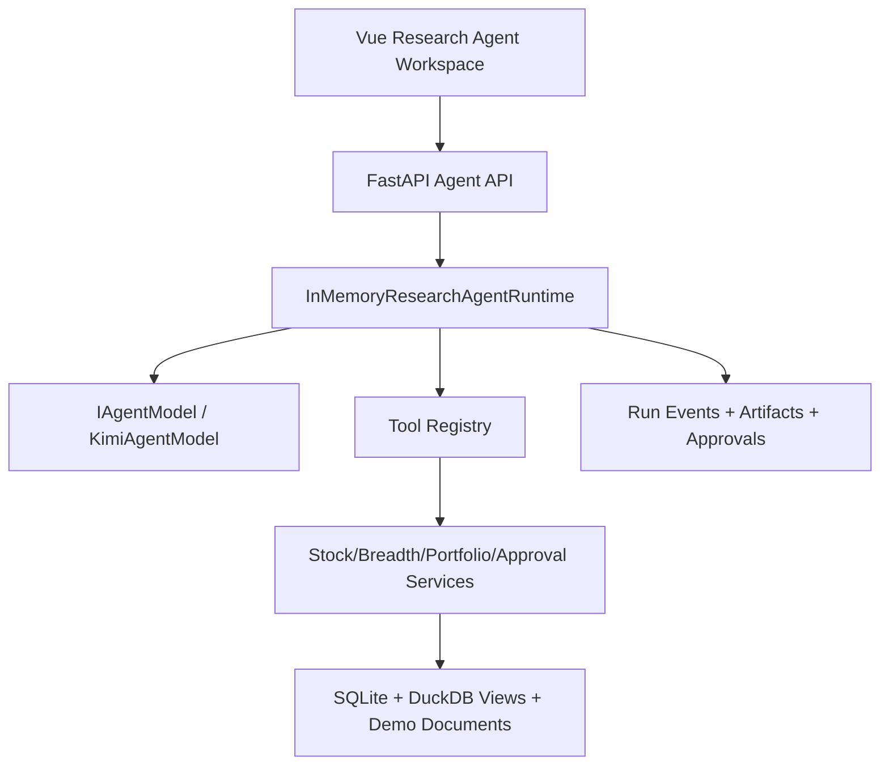

# Research Copilot Architecture

```mermaid
flowchart TD
  Vue[Vue Research Agent Workspace] --> API[FastAPI Agent API]
  API --> Runtime[InMemoryResearchAgentRuntime]
  Runtime --> Model[IAgentModel / KimiAgentModel]
  Runtime --> Tools[Tool Registry]
  Tools --> Services[Stock/Breadth/Portfolio/Approval Services]
  Services --> Data[SQLite + DuckDB Views + Demo Documents]
  Runtime --> Trace[Run Events + Artifacts + Approvals]
```
